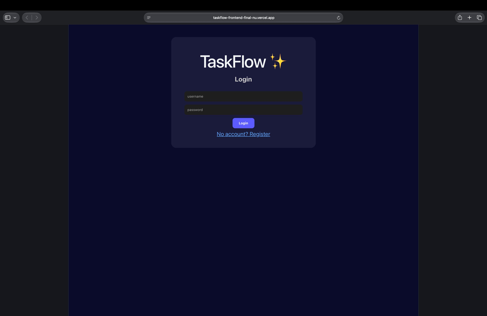

# TaskFlow ⚡ — Fullstack Task Manager
Small but powerful Task API built to learn FastAPI — built in Accra, Ghana 🇬🇭

[](https://taskflow-frontend-final-nu.vercel.app)
[](https://fastapi.tiangolo.com/)
[](https://python.org)
[](https://vercel.com)

### 🚀 Live Links
- **Frontend (Live App):** https://taskflow-frontend-final-nu.vercel.app
- **Backend (Live API):** https://task-api-ze8n.onrender.com
- **API Docs (Swagger):** https://task-api-ze8n.onrender.com/docs
- **GitHub:** https://github.com/randyotengacheampong-lgtm/task-api

### ✨ Features
- Create, Read, Update, Delete Tasks (Full CRUD)
- Interactive Swagger Docs at `/docs`
- FastAPI backend with auto-validation
- Clean Vanilla JS Frontend
- Deployed fullstack: Vercel + Render

### 📚 API Endpoints
- `GET /api` - Root
- `GET /api/tasks` - Get all tasks
- `POST /api/tasks` - Create a new task
- `PUT /api/tasks/{task_id}` - Update a task
- `DELETE /api/tasks/{task_id}` - Delete a task
- `GET /` - Serve Frontend UI

### 🛠️ Tech Stack
**Backend:** Python, FastAPI, Uvicorn, SQLite
**Frontend:** HTML, CSS, Vanilla JavaScript
**Deployment:** Render (API) + Vercel (Frontend)

### 💻 Run Locally
```bash
git clone https://github.com/randyotengacheampong-lgtm/task-api.git
cd task-api
pip install -r requirements.txt
uvicorn main:app --reload
```
### 👨‍💻 Author
Randy Oteng Acheampong (Kofi) — Software Developer, Accra, Ghana 🇬🇭  
- GitHub: [@randyotengacheampong-lgtm](https://github.com/randyotengacheampong-lgtm)
- Stack: FastAPI & JavaScript  
- Mission: Building real products, not just tutorials

## 📸 Live Preview


**Live App:** https://taskflow-frontend-final-nu.vercel.app
**API:** https://task-api-5y9b.onrender.com

---